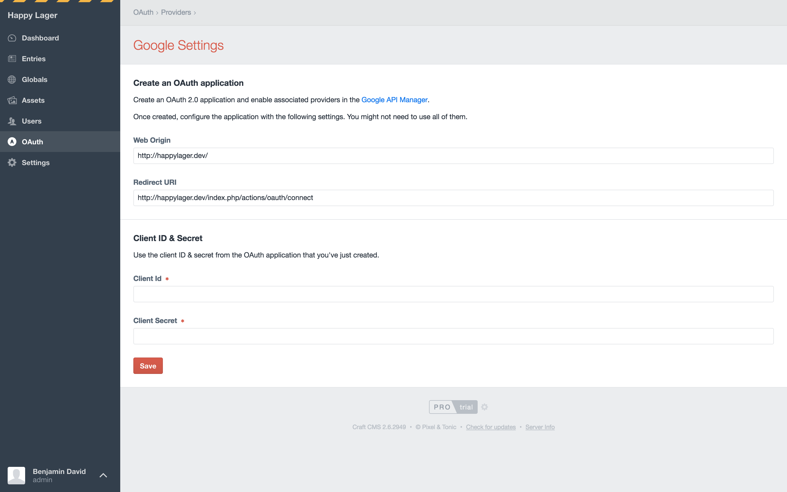
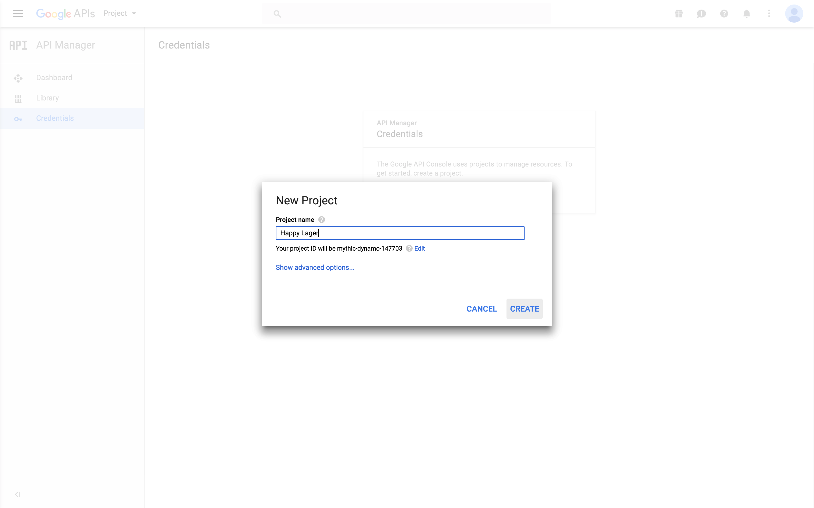
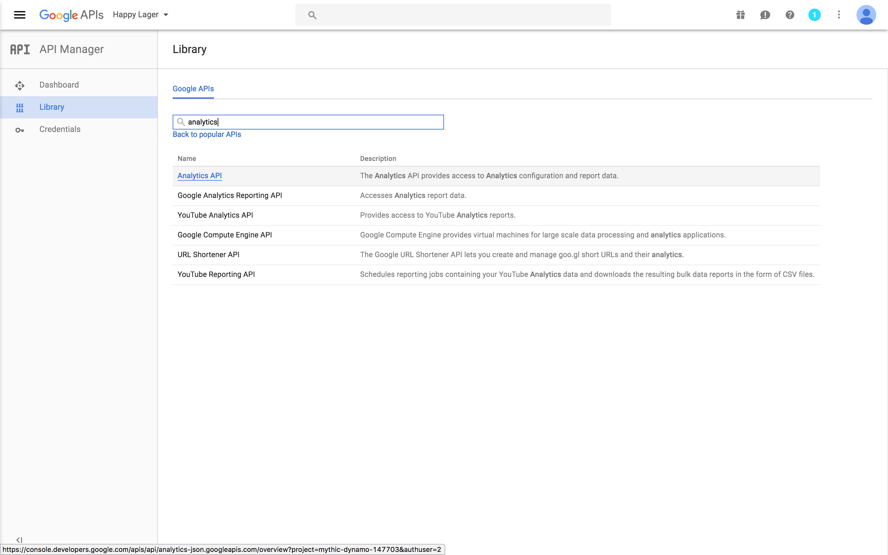
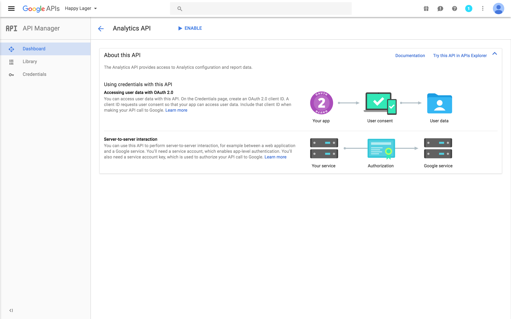
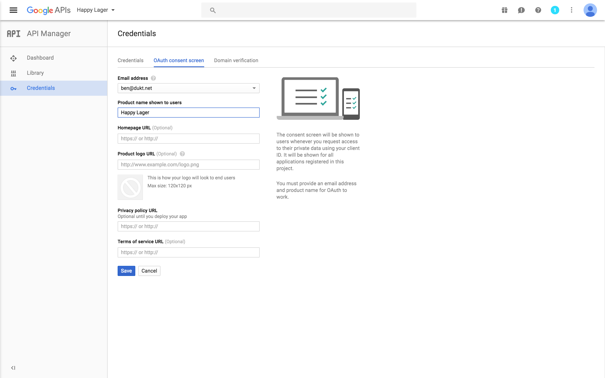
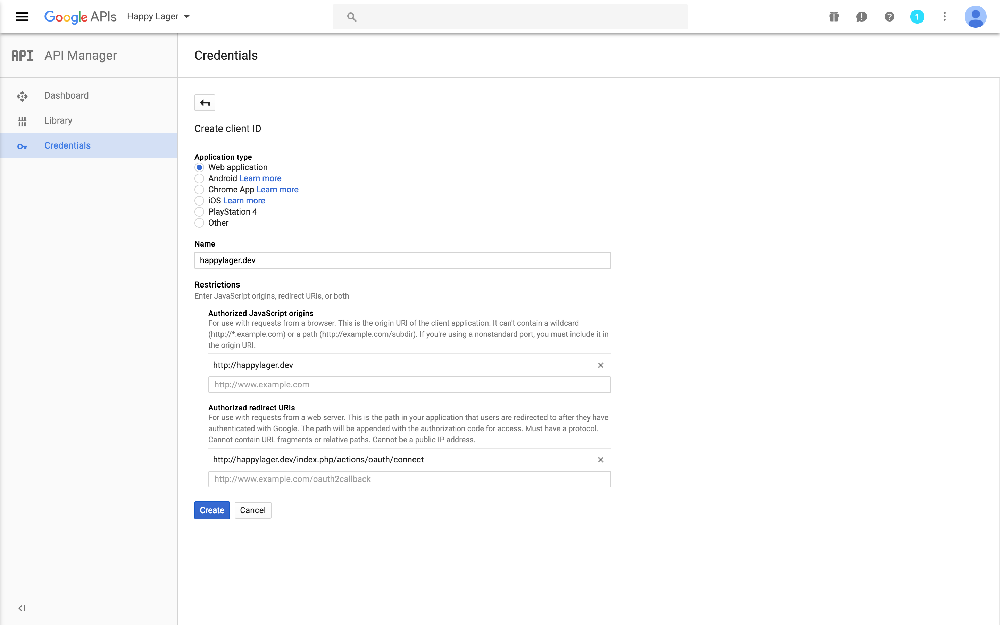
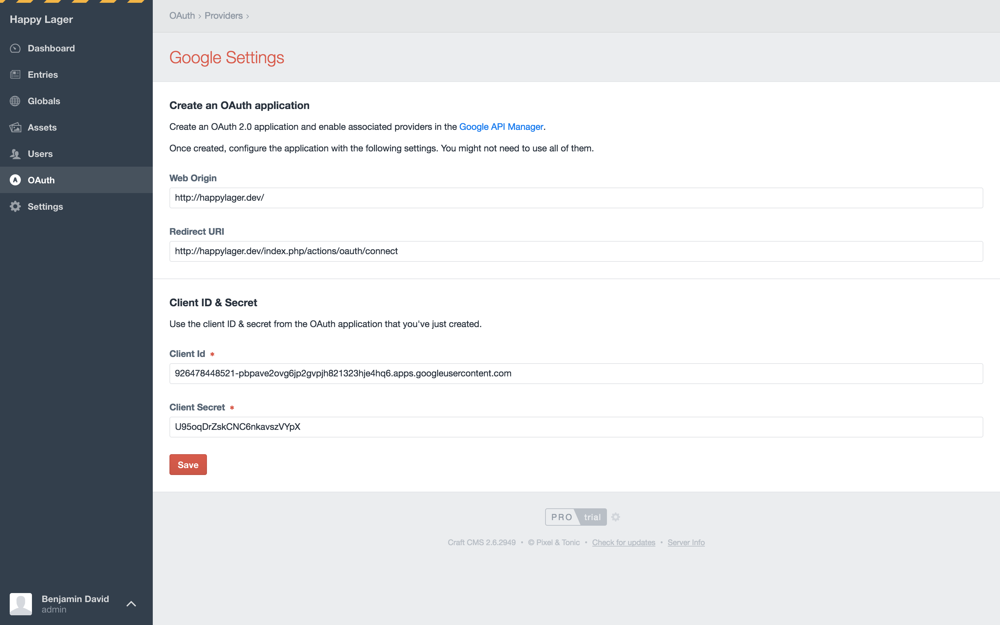

# Connect to Google Analytics

## Create a project in Google's Console

First you need to create a project in Google's Console in order to get a client ID and secret which will allow authentication to Google Analytics.

Go to **Admin / OAuth / Google**.

This page displays the informations that you need to create a Google application :

- **Web Origin**
- **Redirect URI**

### Create a new project

Go to [Google API manangement console](https://code.google.com/apis/console/) and create a new project.

Give it a name, an ID, and click save.

## Enable Analytics API

Enter the project, go to `API Manager > Library` and search for `analytics`.

In the results, click on `Analytics API`:

And enable this API.

## Consent Screen

Go to `API Manager > Credentials > OAuth Consent Screen`.

Give your product a name in the `Product name` field.

## Create a new OAuth client ID

Now move on to `API Manager > Credentials > Credentials` and create a new `OAuth client ID` credential:

Set up the OAuth client with the following settings:

- **Application Type:** Web Application
- **Name:** playground.dev
- **Authorized Javascript Origins:** http://happylager.dev/
- **Authorized Redirect URIs:** http://happylager.dev/index.php/actions/oauth/connect

You can find your origin and redirect URIs in **Craft CP / Settings / Plugins / OAuth / Google**.

Once you are done save the project and client ID & secret are generated:

Copy them back to Craft OAuth settings in **Craft CP / Settings / Plugins / OAuth / Google**:

## Setup Analytics plugin

When you have OAuth and Google settings all configured, go to Analytics plugin settings under **Craft Admin / Settings / Analytics** and click the Connect button.

Choose a website profile to work with, the widgets will display informations for the selected website.

You are now ready to go to your dashboard and add Analytics widgets.

## Tracking code

You need to add the Google Analytics tracking code to your templates for website usage to get logged. The tracking code can be found in the settings of your Google Analytics Property.

## Using Real-Time

Real-Time features is provided as a beta by Google, you will need to [request an access](https://developers.google.com/analytics/devguides/reporting/realtime/v3/) but don't worry, it's really easy to get one. As realt-time is released as beta, this feature might break without warning until Google releases this API publicly.